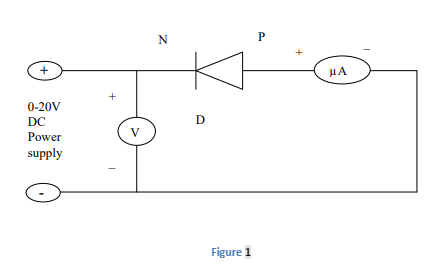

In the case of insulators, the region between highest level of completely filled valence band and the lowest level of allowed conduction band is very wide. This is called energy gap, denoted by Eg and is about 3 eV to 7 eV in case of insulators. In case of semiconductors, this energy gap is quite small. For example, in case of germanium, Eg =0.7 eV and in case of silicon Eg =1.1 eV. In semi conductors at low temperatures, there are few charges carrriers to move so conductivity is quite low. At higher temperatures, the donor or acceptor levels come in to action and provide charge carriers and hence the conduction increases. In addition to the dependence of the electrical conductivity on the number of free charges, it also depends on their mobility. However, mobility of the charge carriers somewhat decrease with increasing temperature but on the average the conductivity of the semiconductors rises with increasing temperature. To determine the energy gap of a semi-conducting material, we study the variation of its conductance with temperature. In reverse bias, the currents flowing through the junction are quite small and internal heating of the junction does not take place.   

In the reverse bias, the saturated value of the reverse current for a PN junction diode is given by, 

Is =A.T3/2 e -Eg/KT _ _ _ _ _(1)  

Where,  

A= constant term 

Is = saturation current in micro ampere  

T = temperature of junction diode in Kelvin  

Eg = band gap in eV  

K = Boltzman constant in eV per Kelvin  

For small changes in temperature where log T can be treated as constant relation (1) can be written as  

log10Is = constant – 5.04 Eg. 103 /T_ _ _ _ (2) 

Graph between 103 /T as abscissa and log10Is as ordinate will be a straight line having a slope = 5.04Eg  

Hence band gap  

Eg = slope of the line / 5.04   

