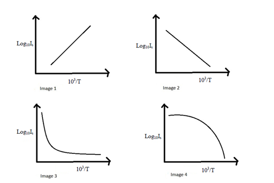

## Pedagogy (Round 1)

 
<b> Experiment: Energy Band Gap    

<b>Discipline | <b>Physical Sciences
:--|:--|
<b> Lab | <b> Basics of Physics
<b> Experiment|     <b> 1. Energy Band Gap

<h4> [1. Focus Area](#LO)
<h4> [2. Learning Objectives ](#LO)
<h4> [3. Instructional Strategy](#IS)
<h4> [4. Task & Assessment Questions](#AQ)
<h4> [5. Simulator Interactions](#SI)

#### 1. Focus Area : Reinforce theoretical concept

#### 2. Learning Objectives and Cognitive Level

Sr. No |	Learning Objective	| Cognitive Level | Action Verb
:--|:--|:--|:-:
1.| Identify the relation between temperature and Reverse saturation current for any PN junction diode. | Recall | Identify
2.| Describe the methodology to vary the temperature of the PN junction diode and to observe the variation in reverse saturation current of the diode. | Understand | Describe
3.| Predict the variation of temperature of the PN junction diode with reverse saturation current in the circuit by plotting a graph between 103 /T and log10Is | Apply | Predict
4.| Examine the slope of plotted graph and calculate the value of Eg. | Analyze | Examine
5.| Conclude the Energy band gap of the given PN junction diode. | Evaluate | Examine

 

    <b><a href="#top">↥ back to top</a></b>

 

#### 3. Instructional Strategy
###### Name of Instructional Strategy  :    Expository Method
###### Assessment Method: Summative

 

    <b><a href="#top">↥ back to top</a></b>

 

#### 4. Task & Assessment Questions:

Read the theory and comprehend the concepts related to the experiment. [LO1, LO2, LO3]
 

Sr. No |	Learning Objective	| Task to be performed by   the student  in the simulator | Assessment Questions as per LO & Task
:--|:--|:--|:-:
1.| Student will identify the relation between temperature and Reverse saturation current for any PN junction diode. | Student will complete introduction. He will be given 4 images for the relation between temperature and Reverse saturation current for any PN junction diode and will choose correct image from them. | Choose the correct image for the graph between 103 /T and log10Is for PN junction diode in reverse bias is:   a) Image 1 b)Image 2 c)Image 3 d)Image 4
2.| To enable the student to describe the methodology to vary the temperature of the PN junction diode and to observe the variation in reverse saturation current of the diode. | Student will be given 4 images for the correct procedure to be followed in the experiment. He will choose correct image from them. | Choose the image which shows the correct order of the procedure to be followed in this experiment:  a) Image 1 b)Image 2 c)Image 3 d)Image 4
3.| Predict the variation of temperature of the PN junction diode with reverse saturation current in the circuit by plotting a graph between 103 /T and log10Is | Student will make circuit connections followed by taking observations for current in the micro-ammeter corresponding to the temperature of the PN Junction by varying the temperature of the heating source. | The plot of 103 /T and log10Is for PN junction diode in reverse bias will be: a) Straight line with positive slope and positive intercept b) Straight line with negative slope positive intercept c) Straight line with negative slope negative intercept  d) Straight line with positive slope negative intercept
4.| Examine the slope of plotted graph and calculate the value of Eg.| Student will take observations for current in micro-ammeter at different temperatures and plot graph between 103 /T and log10Is | The value of the current (nearly) in the PN junction at T=600C when applied potential difference is 5V: a)10µA b)20 µA c)30µA 40µA
5.| Conclude the Energy band gap of the given PN junction diode. | Students will calculate slope of the plotted graph between 103 /T and log10Is and Calculate the energy band gap of the PN junction diode | The Energy band gap of the PN junction diode is: a)3.0 eV b)7.0eV c)3.0 MeV 7.0KeV

You can add more question. All questions may not be as MCQ
Please add the correct answer as well.
or type the correct answer below the question.

  

 <u> You can add additional TASKS & Assessment Questions <u>
 

    <b><a href="#top">↥ back to top</a></b>

 

#### 4. Simulator Interactions:
 

Sr.No | What Students will do? |	What Simulator will do?	| Purpose of the task
:--|:--|:--|:--:
1.| Simulator will allow student to make connections and will alert him in case of wrong connections made. | Student will slide the power button of the simulator to ON position and will set the Potential difference applied to the PN junction.  | To initiate the simulator
2.| Simulator will show the green light indicating that the simulator is ready for use.  | Student will choose the desired temperature from the heater and gradually increase the temperature | To find the current in the PN Junction diode corresponding to the temperature of the Junction.
3.| Simulator will show the corresponding current in the micro-ammeter  | Student will insert the current corresponding to each temperature of the PN junction and mention these values in the table.  | To get the 103 /T and log10Is values with respect to the changing temperature of the junction.
4.| Simulator will calculate 103 /T and log10Is values corresponding to each current value entered in the Table. | Student will press the draw Graph button   | To plot graph between 103 /T and log10Is
5.| Simulator will show plot between 103 /T and log10Is | Student will choose any two points on the graph and press the calculate slope button  | Student will note the value of the slope and calculate the energy band gap value for a given PN junction and will also calculate the percentage error with the standard value.
6.| Slope of the graph will be calculated | Student will change the potential difference applied and will repeat the experiment  | Student will again note the value of the slope and calculate the energy band gap value for a given PN junction and will also calculate the percentage error with the standard value.
